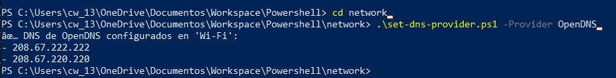

# 🔐 Windows + GitHub Security Scripts

Este repositorio contiene una colección de scripts PowerShell orientados a fortalecer la seguridad, optimizar el rendimiento y automatizar configuraciones en sistemas Windows, así como asegurar tu entorno de desarrollo en GitHub.

---

## 📁 Estructura del Repositorio

- `scripts/` — Scripts generales de seguridad para Windows.
- `network/` — Configuración de red (como DNS seguros).
- `firewall/` — Reglas personalizadas para el firewall de Windows.
- `system/` — Limpieza, tareas programadas y optimización del sistema.
- `.github/workflows/` — Workflows de GitHub Actions (como escaneo de secretos).

---

## ⚙️ Scripts destacados

### `scripts/secure-windows.ps1`

Aplica configuraciones de seguridad básicas al sistema Windows (deshabilitar servicios innecesarios, configurar políticas, etc).

### `firewall/windows-firewall-setup.ps1`

Establece reglas de firewall para bloquear puertos sensibles (como SMB/445), y restringe el acceso de RDP a la red local.

### `network/set-dns-provider.ps1`

Configura servidores DNS seguros como:

- OpenDNS
- Cloudflare
- Quad9
- AdGuard

```powershell
# Ejemplo de uso
.\set-dns-provider.ps1 -Provider OpenDNS


